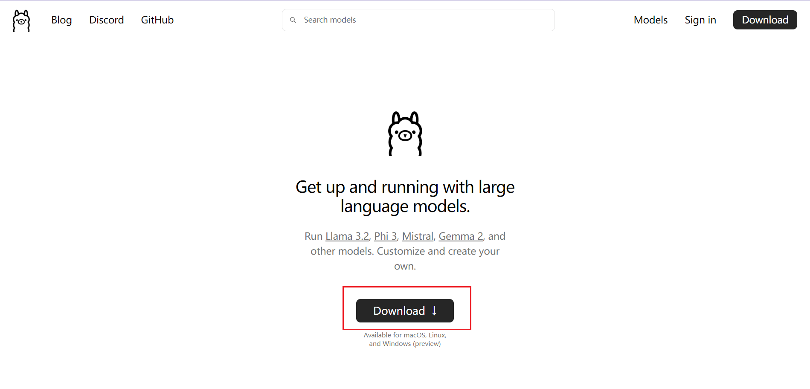

# 使用Ollama本地部署大模型

Ollama 是一个可以帮助我快速本地部署AI大模型的工具。它支持API调用，节约成本。同时它有一个模型市场，可以让我们十分便捷地部署市面上常见的开源模型。

要让大模型直接跑在个人PC上是需要耗费大量资源的。为了达到这目的就需要对大模型做量化。

# 怎么部署？

## Step1:下载ollama客户端，并且安装

[https://ollama.com/](https://ollama.com/)



## Step2:更改大模型保存位置

因为会从模型市场拉取大模型放在本地，而且体积很大。不想让C盘爆满的话，需改变ollama模型下载路径。

打开“编辑系统环境变量”，新加一个变量：

key:OLLAMA_MODELS

value:你想保存模型的位置


## Step3:暴露网络

为了让ollama 可以通过ip来访问还需要配置网络。特别是跟 RAGFlow 搭配使用，输入本机IP访问，使用127.0.0.1是不行的！

打开“编辑系统环境变量”，新加一个变量：

key:OLLAMA_HOST

value:0.0.0.0:11434


## Step4:启动模型

CMD 输入：

```powershell
ollama run qwen2.5:3b
```

没有模型它会自己从模型市场下载。等待完成即可对话了。


# 常见的 Ollama 命令

```powershell
# 拉取模型
ollama pull 模型名称
# 移除模型
ollama rm 模型名称
# 查看已下载模型
ollama list
# 查看系统现在加载好的模型
ollama ps
# 停止模型
ollama stop 模型名称
# 启动模型
ollama run 模型名称
```

# 模型选择经验

在这里可以选择自己想要的模型

[https://ollama.com/library](https://ollama.com/library)

参数量<3B 的尽可能不要选择，精度不好。


看模型的大小估算在你电脑上是用CPU推理还是GPU推理。

当模型大小大于你的显存，它就会使用CPU推理，反之GPU推理。CPU推理会慢一些，能用GPU推理就用GPU推理。