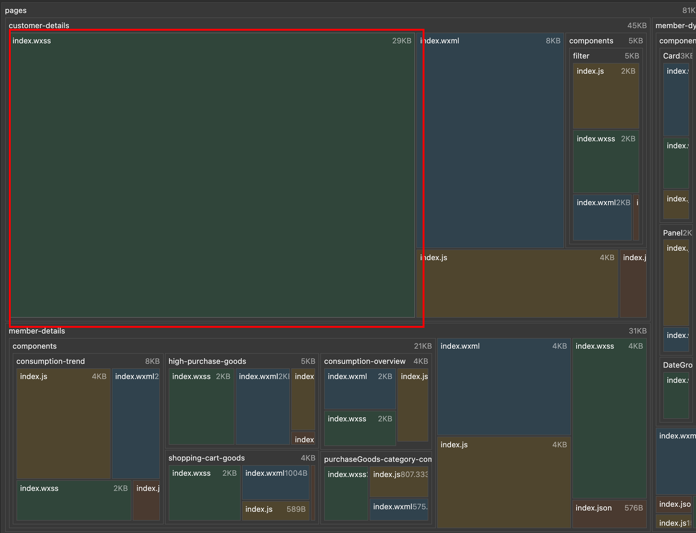

# 脚本清除小程序无引用的 WXSS

# 背景

之前在公司项目里面，第一次尝试使用蓝湖的代码生成功能，导致了生成很多冗余的 wxss 代码。经过我重新写过部分样式后，原来生成的 wxss 没有移除（已经没有在页面引用的），最近发现这些没有的东西还挺站空间的，于是乎我尝试移除冗余的 wxss 代码。问题来了，因为生成的代码实在太多了，我手动比对删除显得就很低效。于是我就找到了 **gulp-cleanwxss**  插件，该插件可以辅助我们快速删除冗余的代码。

仓库地址：https://github.com/Feng373712195/gulp-cleanwxss

# 怎么做？

1. 安装 glup 和 gulp-cleanwxss

```jsx
npm install --save-dev gulp gulp-cleanwxss
```

1. 创建 gulpfile.js 文件编写清除脚本。（脚本可以自己写，我就直接拿来用了。还是比较简单的）

```jsx
// gulpfile.js

const gulp = require( "gulp" );
const cleanwxss = require( "gulp-cleanwxss" );

gulp.task( "default", ( ) => {
    gulp.src( "./pages/**/**.wxss" )
        .pipe( cleanwxss( {
            log:true,
        }))
        .pipe( gulp.dest( "./dest" ) );
} );

```

1. CMD 键入 **glup** 运行默认脚本任务，生成处理过的 wxss 文件（会放在 dest 文件夹下）

# 优化效果

代码体积相交之前缩小了 **21 KB**，效果还是很显著的。

                   
之前： 



之后：

